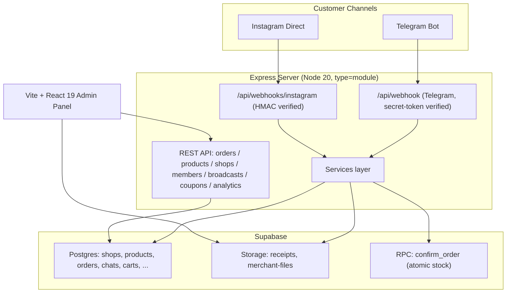

# Conversational-Commerce Platform («Shop-in-a-Chat»)

A **multi-tenant conversational-commerce SaaS**. Each merchant gets an online
store that lives *inside* their **Telegram bot** and **Instagram DMs**, plus a
**React admin panel** to run the business. Payments use the dominant Iranian
card-to-card flow (receipt upload + manual approval).

> **Core product principle:** every merchant is a **non-technical seller**.
> Setup is plug-and-play — paste a token, flip a toggle, tap a button. All
> technical machinery (secret tokens, RLS, idempotency, backoff, audit logs)
> stays invisible behind the scenes.

---

## Architecture



## Tech stack

| Layer | Tech |
|-------|------|
| Runtime | Node.js 20, ES modules (`"type": "module"`) |
| Server | Express 4 |
| Frontend | React 19 + Vite 8 + Tailwind 4 |
| Data | Supabase (Postgres + Storage + RPC) |
| AI | OpenAI-compatible client (OpenRouter) |
| Channels | Telegram Bot API, Instagram Graph webhooks |

## Directory layout

```
server.js              Express app entry: middleware, route mounts, SPA fallback
routes/                REST API + webhook handlers (one router per resource)
services/              Business logic (AI, bot, storage, coupons, loyalty, ...)
middleware/            auth (RBAC), rate limiters, request logger
client/src/            React admin panel (pages, hooks, contexts, utils)
supabase/migrations/   Additive, numbered SQL migrations (see MIGRATIONS.md)
scripts/               CI helpers (check-syntax.mjs)
.github/workflows/     CI pipeline (ci.yml)
```

## REST API surface (`routes/`)

| Router | Mount | Notes |
|--------|-------|-------|
| `webhook.js` | `/api/webhook` | Telegram updates; secret-token verified |
| `instagramWebhook.js` | `/api/webhooks/instagram` | IG updates; raw-body HMAC verified |
| `orders.js` | `/api/orders` | Order list/confirm/receipt/shipment |
| `shops.js` | `/api/shops` | Shop settings, card number, loyalty config |
| `products.js` | `/api/products` | Product CRUD (shop-scoped) |
| `members.js` | `/api/members` | RBAC: shop members + roles |
| `broadcasts.js` | `/api/broadcasts` | Marketing broadcast composer + sender |
| `coupons.js` | `/api/coupons` | Coupon CRUD + validate |
| `analytics.js` | `/api/analytics` | Funnel + per-product + revenue trend |
| `health.js` | `/api` | `/healthz`, `/readyz` |

All admin routes sit behind `authenticateUser`; write/role-gated routes add
`requireShopRole(...)` and per-route rate limiters.

## Services (`services/`)

`aiService` (LLM + checkout state machine), `botManager` (Telegram lifecycle),
`instagramService`, `storageService` (receipts/files), `couponService`,
`loyaltyService`, `abandonedCart`, `broadcastService`, `marketingConsent`,
`shipmentService`, `auditLog`, `idempotency`, `httpRetry` (retry/backoff),
`sheetsService`.

## Data model (high level)

`shops` (per-tenant config: tokens, system prompt, card number, loyalty),
`products`, `orders` (with coupon/loyalty/shipment columns), `chats`, `carts`,
`shop_members` (RBAC), plus idempotency, audit, coupons, and loyalty tables.
See **[MIGRATIONS.md](./MIGRATIONS.md)** for the full additive history and run
order.

## Getting started (local)

```bash
npm ci                 # install dependencies
cp .env.example .env   # then fill in the values (see RUNBOOK.md)
npm run check          # server syntax gate
npm run dev            # Vite dev server (admin panel)
npm start              # Express server (API + bots)
```

Apply database migrations in the Supabase SQL Editor in ascending order before
first run — see **[MIGRATIONS.md](./MIGRATIONS.md)**.

## Scripts

| Script | Does |
|--------|------|
| `npm start` | Run the Express server |
| `npm run dev` | Vite dev server |
| `npm run build` | Build the admin panel |
| `npm run check` | `node --check` across all server files |
| `npm run ci` | `check` + `build` (what CI runs) |

## CI/CD

`.github/workflows/ci.yml` runs on every push / PR: `npm ci` → server syntax
gate (`npm run check`) → admin build (`npm run build`).

## Operations

Environment variables, webhook setup, RBAC/RLS rollout, secret rotation, and
troubleshooting live in **[RUNBOOK.md](./RUNBOOK.md)**.
